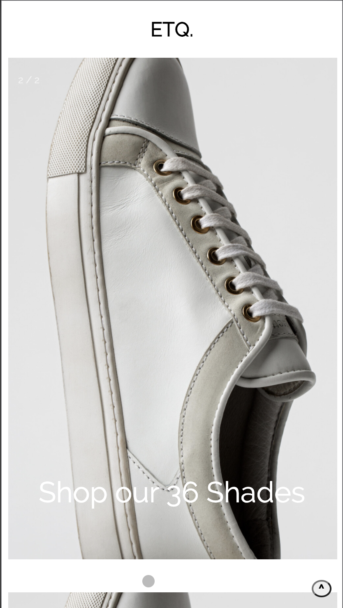

# Procesverslag
**Auteur: Jacco van Rooijen

Markdown cheat cheet: [Hulp bij het schrijven van Markdown](https://github.com/adam-p/markdown-here/wiki/Markdown-Cheatsheet). Nb. de standaardstructuur en de spartaanse opmaak zijn helemaal prima. Het gaat om de inhoud van je procesverslag. Besteedt de tijd voor pracht en praal aan je website.

## Bronnenlijst
1.https://www.youtube.com/watch?v=br-		0i3U1VCA&t=151s&ab_channel=JesseShowalter
2. https://www.youtube.com/watch?v=wmeJMOxyD-w&t=79s&ab_channel=Programster
3. https://css-tricks.com/almanac/properties/t/transform-origin/
4.https://www.youtube.com/watch?v=jx5jmI0UlXU&ab_channel=WebDevSimplified
5.https://www.youtube.com/watch?v=4YQ4svkETS0&ab_channel=TraversyMedia
6.https://css-tricks.com/almanac/selectors/n/nth-of-type/
7.https://stackoverflow.com/questions/11679567/using-css-for-a-fade-in-effect-on-page-load
8.https://css-tricks.com/forums/topic/viewport-height-for-full-screen-div/
9.https://fontawesome.com/icons?d=gallery&q=insta
10.https://www.flaticon.com/free-icon/left-arrow_120826?term=arrow%20back&page=1&position=14
11.https://www.etq-amsterdam.com/

## Eindgesprek (week 7/8)

-dit ging goed & dit was lastig-

**Screenshot(s):**

-screenshot(s) van je eindresultaat-

## Voortgang 3 (week 6)

-same as voortgang 1-

## Voortgang 2 (week 5)

### Stand van zaken

-dit ging goed & dit was lastig-

Het begin is er, het coderen gaat goed maar ik heb nog te veel code staan wat niet van mij is. De opmaak ziet er al goed uit! Nu wil ik aan de slag gaan met de post s van de website.

**Screenshot(s):**

-screenshot(s) van hoe ver je bent-

### Agenda voor meeting

	-Carrousels
	-Nav positioneren
	-Hoeveel animaties zijn er nodig?
	-Schalen van items

### Verslag van meeting

	-Kijk naar heights en widths
	-Ga eigen carrousel maken
	-Probeer semantischer te werken

## Voortgang 1 (week 3)

### Stand van zaken

-dit ging goed & dit was lastig-

De opdrachten gaan goed maar het toepassen op je eigen pagina is natuurlijk een stuk lastiger. Met name het positioneren en schalen van afbeeldingen heb ik moeite mee. Verder is de footer goed gelukt met flexbox en heb ik een Toppage button toegevoegd. Daarnaast heb ik ook een collapsible toegevoegd aan mijn pagina.

**Screenshot(s):**

-screenshot(s) van hoe ver je bent-

### Agenda voor meeting

-samen met je groepje opstellen-

### Verslag van meeting

-na afloop snel uitkomsten vastleggen-

## Intake (week 1)

**Je startniveau:** Rood

**Je focus:** -Surface plane

**Je opdracht:** -https://www.etq-amsterdam.com/?gclid=CjwKCAjwqML6BRAHEiwAdquMnZf8V9XsB0f9ybF3QbAW6VtApHXvKWkuxZZqc14p54dX0_psufmmLRoCg70QAvD_BwE-

**Screenshot(s):**

**Breakdown-schets(en):**

