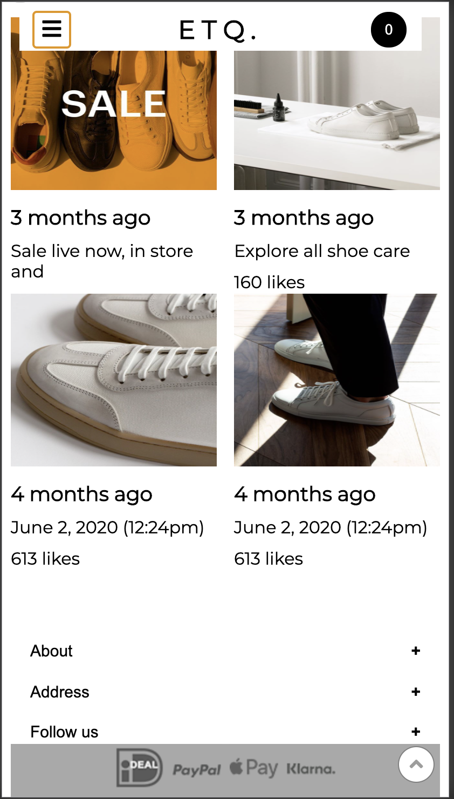
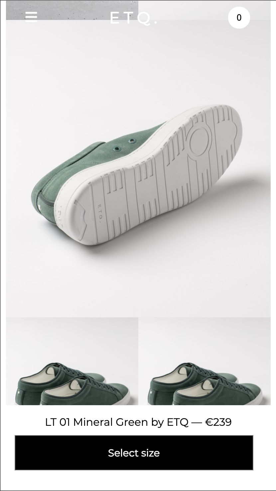

# Procesverslag
**Auteur: Jacco van Rooijen

Markdown cheat cheet: [Hulp bij het schrijven van Markdown](https://github.com/adam-p/markdown-here/wiki/Markdown-Cheatsheet). Nb. de standaardstructuur en de spartaanse opmaak zijn helemaal prima. Het gaat om de inhoud van je procesverslag. Besteedt de tijd voor pracht en praal aan je website.

## Bronnenlijst
1.https://www.youtube.com/watch?v=br-		0i3U1VCA&t=151s&ab_channel=JesseShowalter
2. https://www.youtube.com/watch?v=wmeJMOxyD-w&t=79s&ab_channel=Programster
3. https://css-tricks.com/almanac/properties/t/transform-origin/
4.https://www.youtube.com/watch?v=jx5jmI0UlXU&ab_channel=WebDevSimplified
5.https://www.youtube.com/watch?v=4YQ4svkETS0&ab_channel=TraversyMedia
6.https://css-tricks.com/almanac/selectors/n/nth-of-type/
7.https://stackoverflow.com/questions/11679567/using-css-for-a-fade-in-effect-on-page-load
8.https://css-tricks.com/forums/topic/viewport-height-for-full-screen-div/
9.https://fontawesome.com/icons?d=gallery&q=insta
10.https://www.flaticon.com/free-icon/left-arrow_120826?term=arrow%20back&page=1&position=14
11.https://www.etq-amsterdam.com/

## Eindgesprek (week 7/8)

-dit ging goed & dit was lastig-
In de laatste weken is er nog veel veranderd. 
	-Ik heb bijvoorbeeld met hulp van mijn studentenassistent mijn de javascript van mijn caroussel verbeterd. 
	-Een post verandert naar een link naar mijn detailpagina.
	-Terugknop gemaakt naar de homepagina.
	-Css herschreven met "nth-of-type()".
	-Fade in micro animatie gemaakt
	-Zoom in micro animatie gemaakt op de detailfoto's
	-Schoonheidsfouten eruit gehaald.
	
Mijn site is dus afgerond. Het moeilijkste vind ik toch het feit dat alles samenhangt. Wanneer er 1 onderdeel veranderd kan de rest van de pagina zo compleet verschuiven. Een ander moeilijk punt vond ik ook het werken met "nth of type" ipv classes. Ik ben wel erg blij met het eindresultaat en vind het ook zeker op de originele pagina lijken. Ik ben met name trost op de navigatiebar die van kleur veranderd en hoe mijn caroussel uiteindelijk is geworden.

**Screenshot(s):**

-screenshot(s) van je eindresultaat-

## Voortgang 3 (week 6)

### Stand van zaken

-dit ging goed & dit was lastig-

Mijn site begint er nu al goed uit te zien beide paginas zijn al grotendeels uitgewerkt. Het is gelukt om mijn navigatie van kleur te laten veranderen bij een bepaalde scroll waarde. Alleen is er wel een probleem met mijn javascript die mijn pagina laat crashen als het ware. Verder ziet de pagina er al bijna zo uit zoals ik mij had voorgesteld. Een nadeel is nog wel dat ik het juiste font niet kan gebruiken omdat daar een nogal groot prijskaartje aan hangt. Ook mijn grid afbeeldingen vormen nog niet helemaal mooi mee op alle soorten schermen. Ik heb ook me footer gefixt qua opmaak en positionering. Ik moet nog wel een link naar mijn detailpagina (en teruglink) gaan bedenken en micro animaties toevoegen.

**Screenshot(s):**

### Agenda voor meeting

	-Grids checken
	-Javascript gallery
	-Javascript checken

### Verslag van meeting
	
	-Zoek op codepen voorbeelden.
	-Zorg dat je je javascript snapt
	-Javascript code is beetje valsspelend weg te werken maar probeer het anders. (if else)
	

## Voortgang 2 (week 5)

### Stand van zaken

-dit ging goed & dit was lastig-

Het begin is er, het coderen gaat goed maar ik heb nog te veel code staan wat niet van mij is. De opmaak ziet er al goed uit! Nu wil ik aan de slag gaan met de post s van de website doormiddel van een grid van de website. Ik heb nog geen detailpagina, deze wil ik ook  gaan maken in de aankomende week. Verder krijg ik mijn 1e "beeld" niet op fullscreen, dit wil ik nog wel graag toevoegen omdat ik het een must vind voor het eindresultaaat van de pagina.

**Screenshot(s):**

### Agenda voor meeting

	-Grids
	-Javascript
	-hamburgermenu

### Verslag van meeting
	
	-Zoek op codepen voorbeelden.
	-Zorg dat je je javascript snapt
	

## Voortgang 1 (week 3)

### Stand van zaken

-dit ging goed & dit was lastig-

De opdrachten gaan goed maar het toepassen op je eigen pagina is natuurlijk een stuk lastiger. Met name het positioneren en schalen van afbeeldingen heb ik moeite mee. Verder is de footer goed gelukt met flexbox en heb ik een met javascript een Toppage button toegevoegd. Daarnaast heb ik ook een collapsible toegevoegd aan mijn pagina.

**Screenshot(s):**

### Agenda voor meeting

	-Carrousels
	-Nav positioneren
	-Hoeveel animaties zijn er nodig?
	-Schalen van items

### Verslag van meeting

	-Kijk naar heights en widths
	-Ga eigen carrousel maken
	-Probeer semantischer te werken
	-Drag slider wordt ingewikkeld en kan ik beter overslaan

## Intake (week 1)

**Je startniveau:** Rood

**Je focus:** -Surface plane

**Je opdracht:** -https://www.etq-amsterdam.com/?gclid=CjwKCAjwqML6BRAHEiwAdquMnZf8V9XsB0f9ybF3QbAW6VtApHXvKWkuxZZqc14p54dX0_psufmmLRoCg70QAvD_BwE-

**Screenshot(s):**

**Breakdown-schets(en):**

